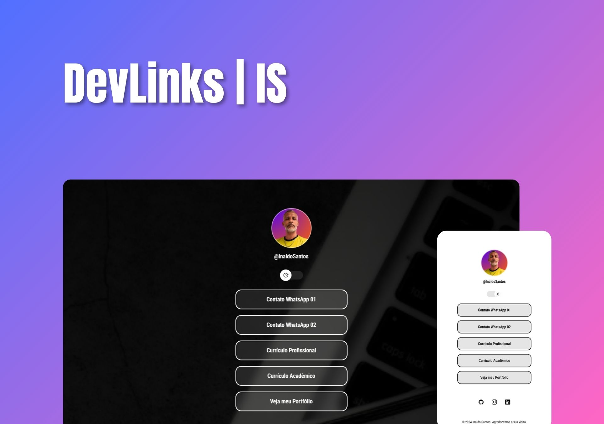

<h1 align="center"> DevLinks | IS </h1>

Este é um projeto simples de uma página web que exibe links úteis e informações de perfil. O projeto utiliza HTML, CSS e JavaScript. Baseado no Programa de ensino em Programação, promovido pela RocketSeat.  
<a href="https://lp.rocketseat.com.br/devlinks/inscricao?utm_source=github&utm_medium=descricao&utm_campaign=capture-devlinks&utm_term=organic&utm_content=descricao-github-mayk-brito">Você pode aprender como construir um projeto  como este clicando aqui.</a>

  <a href="#-funcvisão geralionalidades">Visão Geral</a>&nbsp;&nbsp;&nbsp;|&nbsp;&nbsp;&nbsp;
  <a href="#-funcionalidades">Funcionalidades</a>&nbsp;&nbsp;&nbsp;|&nbsp;&nbsp;&nbsp;
  <a href="#-estrutura do projeto">Estrutura do Projeto</a>&nbsp;&nbsp;&nbsp;|&nbsp;&nbsp;&nbsp;
  <a href="#-tecnologias">Tecnologias</a>&nbsp;&nbsp;&nbsp;|&nbsp;&nbsp;&nbsp;
  <a href="#-projeto">Projeto</a>&nbsp;&nbsp;&nbsp;|&nbsp;&nbsp;&nbsp;
  <a href="#-layout">Layout</a>&nbsp;&nbsp;&nbsp;|&nbsp;&nbsp;&nbsp;
  <a href="#memo-licença">Licença</a>

  

 

  

## Visão Geral

Este projeto apresenta um perfil de desenvolvedor com links para contatos, currículos e redes sociais.

## Funcionalidades

**Perfil**: Exibe uma imagem de perfil e o nome de usuário. 
**Modo de Exibição**: Alterna entre modos de exibição (claro e escuro). 
**Links de Contato**: Inclui links para dois contatos de WhatsApp.  
**Currículos**: Links para currículos profissional e acadêmico. 
**Portfólio**: Um link para o portfólio no GitHub. 
**Redes Sociais**: Links para perfis no GitHub, Instagram e LinkedIn.

## Estrutura do Projeto

`index.html`: Estrutura principal da página. 
`style.css`: Estilos para a página.  
`script.js`: Scripts para funcionalidades da página.  

## Tecnologias

Esse projeto foi desenvolvido com as seguintes tecnologias:

- HTML e CSS
- JavaScript
- Git e Github
- Figma

## Projeto

O DevLinks é um agregador de links que pode ser usado como cartão de visitas online.

- [Acesse o projeto finalizado, online](https://InaldoSantos.github.io/devlinks-IS)

- [Construa o seu também](https://lp.rocketseat.com.br/devlinks/inscricao?utm_source=github&utm_medium=descricao&utm_campaign=capture-devlinks&utm_term=organic&utm_content=descricao-github-mayk-brito)

## 🔖 Layout

Você pode visualizar o layout do projeto através [DESSE LINK](https://www.figma.com/community/file/1187422022288947321). É necessário ter conta no [Figma](https://figma.com) para acessá-lo.

## :memo: Licença

Esse projeto está sob a licença MIT.

---

Construido com base no projeto do curso da [Rocketseat](https://lp.rocketseat.com.br/devlinks/inscricao?utm_source=github&utm_medium=descricao&utm_campaign=capture-devlinks&utm_term=organic&utm_content=descricao-github-mayk-brito)
